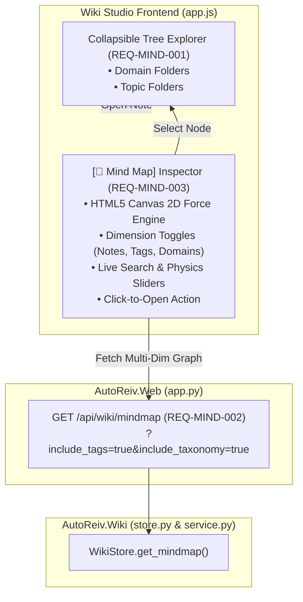

# Technical Design Specification: Wiki Studio Interactive Mind Map & Tree Navigation

> **Document ID**: `DESIGN-WIKI-MINDMAP-001`  
> **Status**: Approved  
> **Traceability ID**: `[REQ-MIND-001]` through `[REQ-MIND-003]`

---

## 1. Architectural Overview



---

## 2. Multi-Dimensional Graph Schema

```json
{
  "nodes": [
    {
      "id": "notes/information_technology/ai_engineering/autonomous_agent_topology.md",
      "label": "Autonomous Agent Topology",
      "type": "note",
      "domain": "information_technology",
      "topic": "ai_engineering",
      "tags": ["topology", "architecture", "agents"],
      "words": 9,
      "tokens": 19,
      "path": "notes/information_technology/ai_engineering/autonomous_agent_topology.md"
    },
    {
      "id": "tag:topology",
      "label": "#topology",
      "type": "tag",
      "count": 1
    },
    {
      "id": "domain:information_technology",
      "label": "🎓 information_technology",
      "type": "domain",
      "count": 2
    }
  ],
  "edges": [
    {
      "source": "notes/information_technology/ai_engineering/autonomous_agent_topology.md",
      "target": "notes/information_technology/ai_engineering/agent_memory.md",
      "type": "wikilink",
      "label": "links_to"
    },
    {
      "source": "notes/information_technology/ai_engineering/autonomous_agent_topology.md",
      "target": "tag:topology",
      "type": "has_tag",
      "label": "tagged"
    }
  ]
}
```

---

## 3. Interactive 2D Force-Directed Simulation Engine

- **Self-contained HTML5 Canvas Engine**:
  - Node physics: Verlet integration / Velocity Euler with Coulomb repulsion ($F_r = k / d^2$), Hooke spring tension ($F_s = -k \cdot (d - d_0)$), and center gravitational pull.
  - Node visual rendering:
    - `note`: Blue-indigo glowing circle (radius scaled with token count or degree centrality) with label.
    - `tag`: Emerald-green pill/circle with `#` symbol.
    - `domain`: Amber hexagon/circle with degree emoji.
    - `topic`: Sky-blue diamond/circle.
  - Color palettes per domain or node type.
  - Smooth pan-tilt-zoom with mouse drag and wheel zoom.
  - Interactive click handler: resolves nearest node within hit radius; if type is `note`, calls `loadWikiNote(path)` and closes modal or focuses note view.
