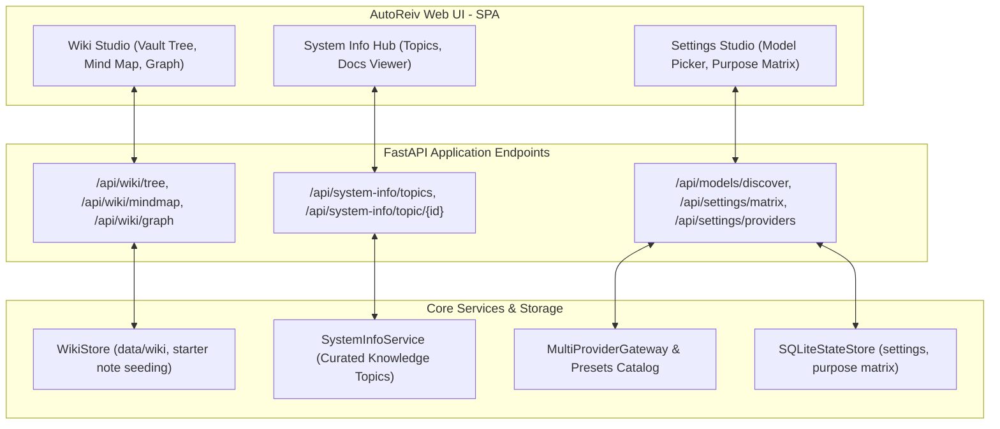

# Technical Design: Wiki Vault Seeding, System Info Resiliency & Settings Matrix Hardening

## Component Architecture & Data Flow



## Data Contracts

### 1. `GET /api/models/discover` Resilient Fallback Contract
```json
{
  "models": [
    {
      "id": "ollama/llama3.2:1b",
      "name": "llama3.2:1b",
      "provider": "ollama",
      "param_size_b": 1.0,
      "quantization": "Q4_K_M",
      "family": "llama3.2",
      "estimated_ram_gb": 1.5,
      "fit_status": "optimal",
      "notes": "Preset model (Provider offline or ready)"
    }
  ]
}
```

### 2. `POST /api/settings/matrix` Unified Ingestion Contract
```json
{
  "default_model": "llama3.2:1b",
  "purposes": {
    "general": "llama3.2:1b",
    "reasoning": "deepseek-r1:8b",
    "task_execution": "qwen2.5-coder:7b",
    "vision": "default",
    "auxiliary": "default",
    "fast": "llama3.2:1b"
  }
}
```
