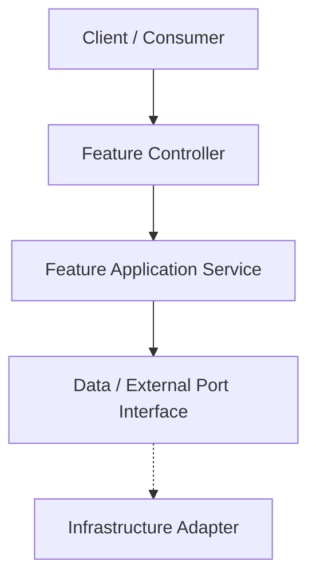
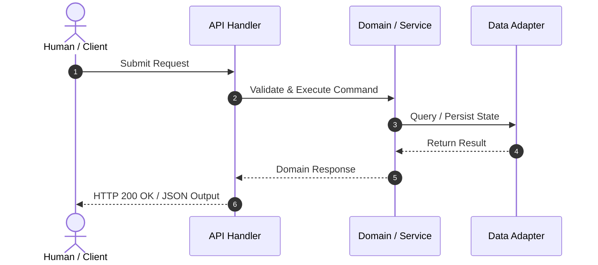

# Technical Design: [Feature Name]

> **Linked Spec**: [`requirements.md`](./requirements.md)  
> **Applicable ADRs**: `docs/adr/0001-baseline-sdlc.md`

---

## 1. Architectural Overview & C4 Context



---

## 2. Sequence Flow



---

## 3. Data Contracts & Interfaces

### Public Interfaces / Ports
```python
class FeaturePort(Protocol):
    def execute(self, command: CommandDTO) -> ResultDTO:
        ...
```

### Data Transfer Objects / Schemas
```json
{
  "$schema": "http://json-schema.org/draft-07/schema#",
  "type": "object",
  "properties": {
    "id": { "type": "string" },
    "status": { "type": "string" }
  },
  "required": ["id", "status"]
}
```

---

## 4. Error Handling & Edge Cases

| Error Scenario | Detection Point | Handling / Fallback | User Response |
| :--- | :--- | :--- | :--- |
| Invalid Payload | API Layer | Schema Validation | HTTP 400 with field details |
| Timeout / Downstream Error | Adapter Layer | Circuit Breaker / Retry | HTTP 503 / Friendly message |
