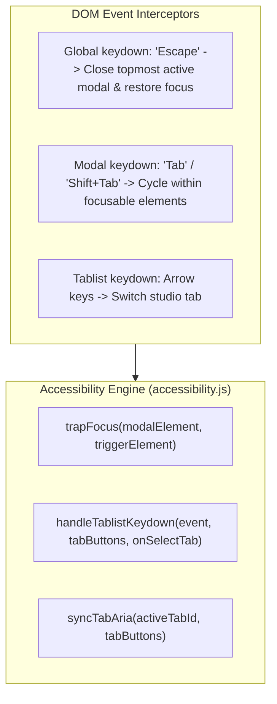

# Technical Design: Mobile & Keyboard Accessibility

> **Spec Status**: In Review  
> **Card Reference**: [CARD-038](file:///.github/cards/CARD-038-mobile-and-keyboard-accessibility.md)  
> **Requirements Reference**: [requirements.md](file:///d:/Projects/Active/AutoReiv/docs/specs/accessibility-and-focus-traps/requirements.md)

---

## 1. Architectural Modeling



---

## 2. Module Interfaces & Signatures

### `src/web/static/modules/utils/accessibility.js`

```javascript
/**
 * Returns all currently visible focusable elements inside a container.
 * @param {HTMLElement} container
 * @returns {HTMLElement[]}
 */
export function getFocusableElements(container) { ... }

/**
 * Handles Tab and Shift+Tab keydown events to wrap focus within container.
 * @param {KeyboardEvent} event
 * @param {HTMLElement} container
 */
export function handleFocusTrapKeydown(event, container) { ... }

/**
 * Handles arrow key navigation across tab buttons.
 * @param {KeyboardEvent} event
 * @param {HTMLElement[]} tabButtons
 * @param {function(string): void} onSelectTab
 */
export function handleTablistKeydown(event, tabButtons, onSelectTab) { ... }

/**
 * Synchronizes aria-selected and tabindex on tab buttons and aria-hidden on tab panels.
 * @param {string} activeTabId
 * @param {NodeListOf<HTMLElement>|HTMLElement[]} tabButtons
 * @param {NodeListOf<HTMLElement>|HTMLElement[]} tabPanels
 */
export function syncTabAria(activeTabId, tabButtons, tabPanels) { ... }
```

---

## 3. Data & State Management
- `activeModal`: Holds `{ element: HTMLElement, trigger: HTMLElement, cleanup: Function }` stack.
- `Escape` key listener pops the stack and calls the modal close handler.
