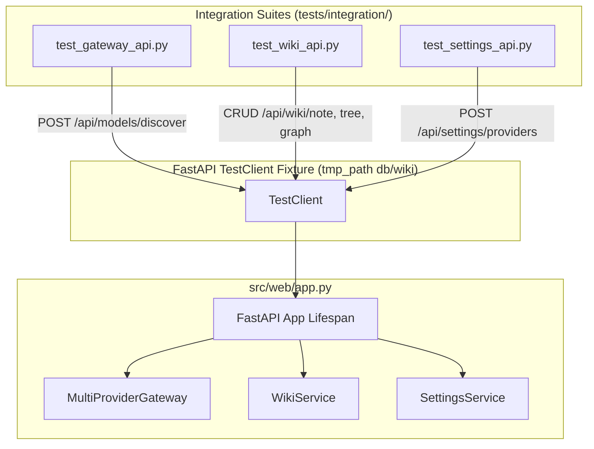

# Technical Design: Gateway, Wiki & Settings End-to-End API Contract Integration Tests

> **Spec Status**: In Review  
> **Card Reference**: [CARD-036](file:///.github/cards/CARD-036-gateway-wiki-and-settings-end-to-end-api-contract-integration-tests.md)  
> **Requirements Reference**: [requirements.md](file:///d:/Projects/Active/AutoReiv/docs/specs/api-contract-integration-tests/requirements.md)

---

## 1. Architectural Modeling

---

## 2. Test Architecture & Coverage Matrix

### 1. `tests/integration/test_gateway_api.py`
- Test model discovery against simulated provider endpoints using `unittest.mock` for `httpx`.
- Test `/api/settings/presets` returning valid default dictionary.
- Test error propagation on unreachable host (502 / graceful empty list).

### 2. `tests/integration/test_wiki_api.py`
- Test `GET /api/wiki/tree` on empty and populated vaults.
- Test `POST /api/wiki/note` with YAML frontmatter tags/domains.
- Test `GET /api/wiki/note` and `PUT /api/wiki/note` updates.
- Test `DELETE /api/wiki/note` removing markdown file.
- Test `GET /api/wiki/graph` returning nodes and links with degree relationships.
- Test `POST /api/export/wiki` from session messages into staging inbox.

### 3. `tests/integration/test_settings_api.py`
- Test `GET /api/settings` returning current configuration.
- Test `POST /api/settings/providers` with custom host/keys and verifying masking (`****`).
- Test `POST /api/settings/matrix` updating purpose model mappings.
- Test `GET /api/system-info/topics` and `GET /api/system-info/topic/{topic_id}`.
