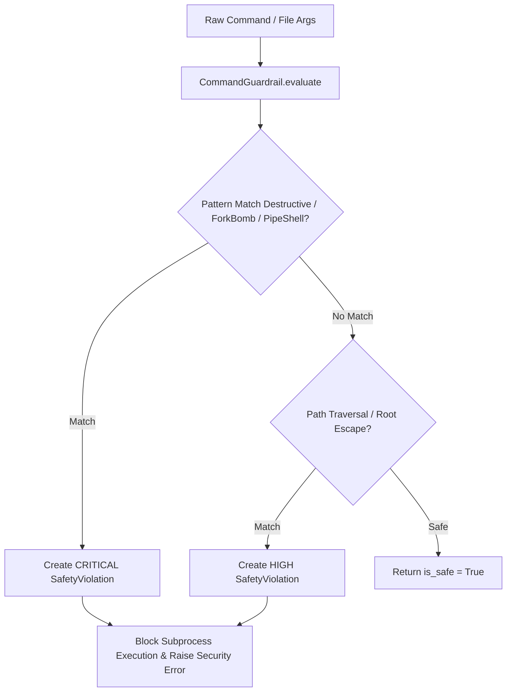

# Technical Design: Dangerous Shell Command Safety Guardrails & Path Traversal Protection

> **Spec Status**: In Review  
> **Card Reference**: [CARD-045](file:///.github/cards/CARD-045-dangerous-shell-command-safety-guardrails-and-path-traversal-protection.md)  
> **Requirements Reference**: [requirements.md](file:///d:/Projects/Active/AutoReiv/docs/specs/command-safety-guardrails/requirements.md)

---

## 1. Architectural Modeling



---

## 2. Signatures & Interface Updates

### `src/domain/safety/models.py`
```python
class RiskLevel(str, Enum):
    SAFE = "safe"
    LOW = "low"
    MEDIUM = "medium"
    HIGH = "high"
    CRITICAL = "critical"


class SafetyViolation(BaseModel):
    rule_id: str
    risk_level: RiskLevel
    reason: str
    matched_pattern: str


class CommandSafetyReport(BaseModel):
    command: str
    is_safe: bool
    highest_risk: RiskLevel
    violations: List[SafetyViolation]
```

### `src/application/safety/command_guardrail.py`
```python
class CommandGuardrail:
    @classmethod
    def evaluate(cls, command: str, workspace_root: Optional[str] = None) -> CommandSafetyReport: ...
    @classmethod
    def is_safe(cls, command: str, workspace_root: Optional[str] = None) -> bool: ...
    @classmethod
    def check_path_traversal(cls, path: str, workspace_root: Optional[str] = None) -> Optional[SafetyViolation]: ...
```
