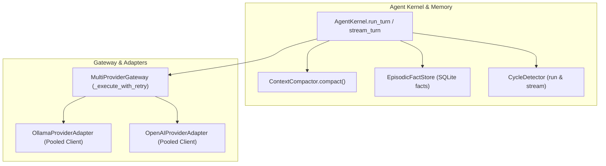

# Technical Design: Context Compaction, Episodic Memory & Resilience Hardening

> **Linked Spec**: [`requirements.md`](./requirements.md) | [`tasks.md`](./tasks.md)  
> **Applicable ADRs**: `docs/adr/0010-context-compaction-episodic-memory-and-gateway-resilience-hardening.md`

---

## 1. System Architecture & Component Interactions



---

## 2. Component Design & Interfaces

### 2.1. `ContextCompactor` (`src/application/kernel/context_compactor.py`)
```python
class ContextCompactor:
    @staticmethod
    def compact(
        messages: List[ChatMessage],
        max_tokens: int = 4000,
        keep_last_n_turns: int = 4,
        max_tool_chars: int = 8000,
    ) -> List[ChatMessage]:
        ...
```

### 2.2. `EpisodicFactStore` (`src/infrastructure/memory/sqlite_store.py`)
```sql
CREATE TABLE IF NOT EXISTS episodic_facts (
    id TEXT PRIMARY KEY,
    entity TEXT NOT NULL,
    key TEXT NOT NULL,
    value TEXT NOT NULL,
    confidence REAL DEFAULT 1.0,
    source_session_id TEXT,
    created_at TIMESTAMP DEFAULT CURRENT_TIMESTAMP,
    updated_at TIMESTAMP DEFAULT CURRENT_TIMESTAMP,
    UNIQUE(entity, key)
);
CREATE INDEX IF NOT EXISTS idx_facts_entity ON episodic_facts(entity);
```

### 2.3. Resilient Retry Loop (`src/application/gateway/gateway_service.py`)
```python
backoff = (2 ** attempt) + random.uniform(0.1, 0.5)
```
