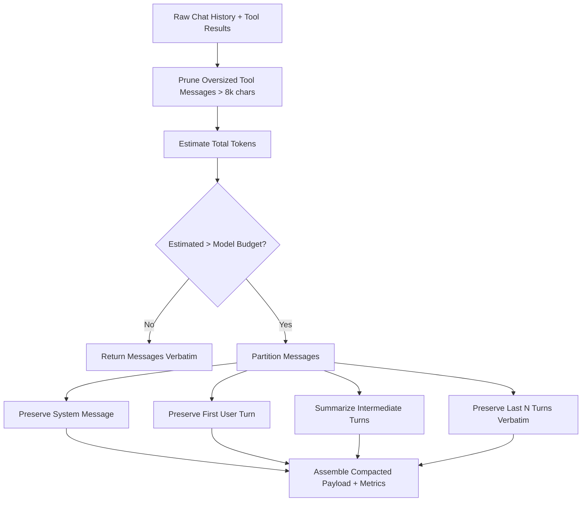

# Technical Design: Context Window Compaction & Sliding Dynamic Token Budget Strategy

> **Spec Status**: In Review  
> **Card Reference**: [CARD-041](file:///.github/cards/CARD-041-context-window-compaction-and-dynamic-token-budget-strategy.md)  
> **Requirements Reference**: [requirements.md](file:///d:/Projects/Active/AutoReiv/docs/specs/context-window-compaction/requirements.md)

---

## 1. Architectural Modeling



---

## 2. Data Models & Signatures

### `src/application/kernel/context_compactor.py`

```python
@dataclass
class CompactionMetrics:
    original_tokens: int
    compacted_tokens: int
    turns_compacted: int
    tools_truncated: int
    compression_ratio: float
    compacted_applied: bool


def get_model_context_limit(model_name: str) -> int:
    """Returns context limit in tokens based on model name patterns."""
    ...


class ContextCompactor:
    @classmethod
    def compact_with_stats(
        cls,
        messages: List[ChatMessage],
        model_name: str = "default",
        max_tokens: Optional[int] = None,
        keep_last_n_turns: int = 4,
        max_tool_chars: int = 8000,
        preserve_root_intent: bool = True,
    ) -> Tuple[List[ChatMessage], CompactionMetrics]: ...
```
