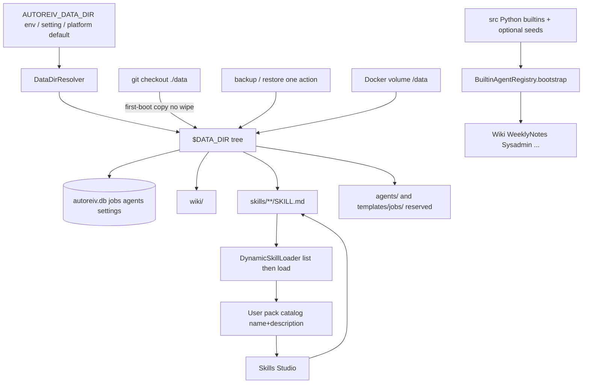
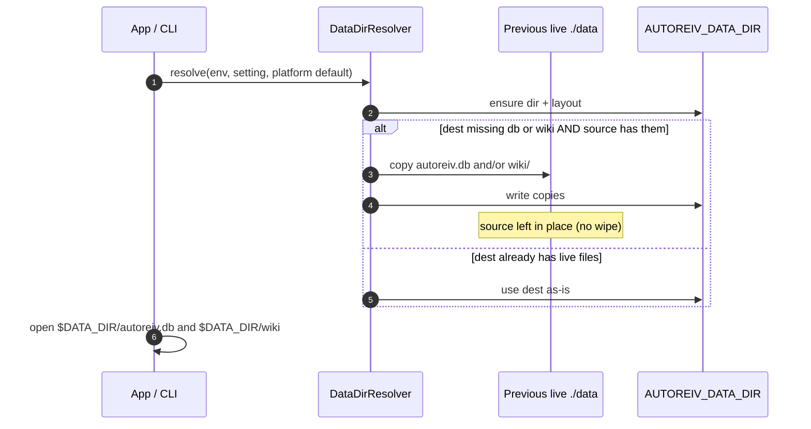
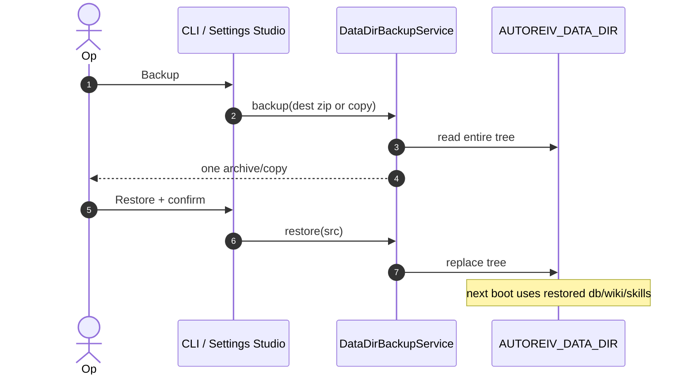
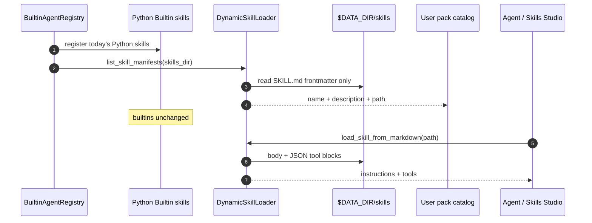

# Technical Design: Control Plane Data Dir

> **Linked Spec**: [`requirements.md`](./requirements.md)
> **Applicable ADRs**: `docs/adr/0001-baseline-sdlc.md`, `docs/adr/0009-multi-os-packaging-docker-compose-systemd-and-unified-cli-entry-point.md`, `docs/adr/0013-mcp-standard-client-adapter-and-dynamic-skill-loader.md`
> **Locked architecture**: Slice A Job/Phase stays. Slice B is the data plane only. Do not invent a fourth loop. Do not move the kernel.

---

## 1. Architectural Overview & C4 Context

Adopt proven patterns only: Hermes `~/.hermes` user-data-outside-repo, agentskills.io `SKILL.md` + progressive disclosure, zip/copy backup of one tree.



Existing modules this slice extends (no new kernel):

| Layer | Today | Slice B |
|-------|--------|---------|
| Paths | `AUTOREIV_DB_PATH` default `./data/autoreiv.db`; `AUTOREIV_WIKI_PATH` default `./data/wiki` | One `AUTOREIV_DATA_DIR`; db/wiki/skills derived; explicit db/wiki env still wins |
| App factory | `src/web/app.py` reads the two env vars independently | Resolve data dir first; pass derived paths; migrate on first boot |
| CLI | `--db-path` / `--wiki-path` | Add `--data-dir`; `backup` / `restore` subcommands |
| Docker | Two volume mounts | One tree at `/data` |
| Skills | Python classes registered in `BuiltinAgentRegistry.bootstrap`; `DynamicSkillLoader` unused at boot | Keep Python builtins; scan `$DATA_DIR/skills` for USER packs |
| Web | Agent Studio (Forge) tab | Sibling Skills Studio tab |
| Custom agents | SQLite in the app db | Stay in that db once the db lives in the data dir |
| Job templates | `jobs.template_id` nullable | Still nullable. YAML later. Not designed here beyond a reserved folder |

---

## 2. Sequence Flow

### 2.1 First boot: resolve + migrate (CARD-102)



### 2.2 Backup and restore (CARD-103)



### 2.3 User pack mount with progressive disclosure (CARD-104)



---

## 3. Data Contracts & Interfaces

### 3.1 Directory tree (minimum)

```text
$AUTOREIV_DATA_DIR/
  autoreiv.db              # live SQLite: jobs, phases, custom agents, settings, sessions
  wiki/                    # live PARA wiki
  skills/
    <pack-slug>/
      SKILL.md             # agentskills.io (YAML frontmatter + body + optional ```json tools)
  agents/                  # reserved; Slice B SoT for custom agents remains SQLite
  templates/
    jobs/                  # reserved; job-template YAML is later cards
```

Platform defaults for `AUTOREIV_DATA_DIR` when unset:

| Runtime | Default |
|---------|---------|
| Windows | `%LOCALAPPDATA%\AutoReiv` |
| POSIX | `~/.autoreiv` |
| Docker | `/data` (compose sets the env) |

Resolution order: environment `AUTOREIV_DATA_DIR` > persisted setting `data_dir` > platform default.

Derived paths when the explicit overrides are unset:

- `AUTOREIV_DB_PATH` = `$DATA_DIR/autoreiv.db`
- `AUTOREIV_WIKI_PATH` = `$DATA_DIR/wiki`
- skills root = `$DATA_DIR/skills`

`AUTOREIV_DB_PATH` and `AUTOREIV_WIKI_PATH` remain escape hatches.

### 3.2 SKILL.md (agentskills.io)

Frontmatter (catalog / progressive disclosure):

```yaml
---
name: weekly-review
description: SOP for rolling weekly notes into the next week.
---
```

Body is the playbook (SOP). Optional fenced `json` blocks with `name` + `parameters` become `ToolDefinition`s via today's `DynamicSkillLoader`.

Playbook vs job template:

| Object | Format | Lives | Slice B |
|--------|--------|-------|---------|
| Playbook | SOP prose in `SKILL.md` | `$DATA_DIR/skills/<slug>/SKILL.md` | First-class |
| Job template | YAML describing Job+Phases | `$DATA_DIR/templates/jobs/` later | Stub / reserved folder only |

Do not store a job template inside `SKILL.md`. Do not treat a playbook as a runnable Job.

### 3.3 Domain ports

```python
class DataDirPaths:
    root: Path
    db_path: Path
    wiki_path: Path
    skills_path: Path
    agents_path: Path
    job_templates_path: Path


class DataDirResolver(Protocol):
    def resolve(self) -> DataDirPaths: ...
    def migrate_if_needed(self, paths: DataDirPaths) -> None: ...
    # copy, never wipe; skip if dest already has the live file


class DataDirBackupService(Protocol):
    def backup(self, dest: Path) -> Path: ...   # zip or copy of the whole tree
    def restore(self, src: Path, *, confirm: bool) -> None: ...  # replace-the-tree


class UserSkillManifest(BaseModel):
    id: str
    name: str
    description: str
    path: str
    origin: Literal["user"] = "user"


class UserSkillCatalog(Protocol):
    def list_manifests(self) -> list[UserSkillManifest]: ...
    def load_body(self, pack_id: str) -> dict: ...  # DynamicSkillLoader.load_skill_from_markdown
```

`DynamicSkillLoader.scan_skills_directory` stays for full-tree tests. Bootstrap and catalog list must use a frontmatter-only helper (new method on the same class, or a thin wrapper). Do not parse every body at boot.

Name collision: if a user pack tool `name` matches a Python builtin tool, keep the builtin, skip or suffix the user tool, log honestly.

### 3.4 HTTP (CARD-103 / CARD-105)

```text
GET  /api/data-dir                  -> { root, db_path, wiki_path, skills_path }
POST /api/data-dir/backup           -> file download or { path }
POST /api/data-dir/restore          -> multipart zip; requires confirm=true

GET  /api/skills/user-packs         -> [{ id, name, description, path }]
GET  /api/skills/user-packs/{id}    -> { manifest, instructions, tools: [{name, description}] }
PUT  /api/skills/user-packs/{id}    -> write SKILL.md body/frontmatter on disk
```

Exact handler names may follow existing router style. Writes are jailed to `$DATA_DIR/skills`. Builtin Python skills are not editable here.

Existing `GET /api/skills/catalog` (CARD-018 hierarchical Python packs) stays. User packs are an additional list, not a replacement.

### 3.5 CLI

```text
autoreiv --data-dir <path> serve
autoreiv backup [dest.zip]
autoreiv restore <src.zip> --yes
```

`--db-path` / `--wiki-path` remain. `--data-dir` sets `AUTOREIV_DATA_DIR` for the process.

### 3.6 Docker

Replace:

```yaml
- ./data/autoreiv.db:/data/autoreiv.db
- ./data/wiki:/data/wiki
```

with one tree:

```yaml
environment:
  - AUTOREIV_DATA_DIR=/data
volumes:
  - autoreiv-data:/data
```

`.env.example` gains `AUTOREIV_DATA_DIR`. Legacy db/wiki vars stay documented as overrides.

---

## 4. Error Handling & Edge Cases

| Error Scenario | Detection Point | Handling / Fallback | User Response |
| :--- | :--- | :--- | :--- |
| `AUTOREIV_DATA_DIR` unset | Resolver | Platform default outside the repo | Settings shows the resolved path |
| Dest empty, `./data` has live files | Migrate | Copy db and/or wiki; leave source | Next boot uses dest; source remains |
| Dest already has `autoreiv.db` | Migrate | Do not overwrite | Keep dest db |
| Copy fails mid-migrate | Migrate | Do not open a new empty dest db as live | Fail start or keep previous live paths; honest error |
| Backup while db is open | Backup | Use a consistent snapshot (SQLite backup API or copy after checkpoint) | Archive is restorable |
| Restore without confirm | Restore | No-op | Live tree unchanged |
| Restore zip missing `autoreiv.db` | Restore | Reject | Honest error; no partial replace |
| Path escape from skills API | Skills router | Reject | 400; no write outside `$DATA_DIR/skills` |
| User pack tool name collides | Bootstrap mount | Builtin wins; skip/suffix user tool | Log; catalog still lists the pack |
| Missing `skills/` dir | Bootstrap | Create empty dir; Python builtins only | App starts |
| `scan_skills_directory` full parse at boot | Bootstrap | Forbidden | Use list-only frontmatter path |

---

## 5. UI wireframes

### 5.1 Settings Studio -- data dir + backup (CARD-102, CARD-103)

```text
+------------------------------------------------------------------+
| Settings                                                         |
+------------------------------------------------------------------+
| Data directory                                                   |
| Path: [ C:\Users\jacob\AppData\Local\AutoReiv                 ]  |
|        resolved from env / setting / platform default            |
| db:    ...\AutoReiv\autoreiv.db                                  |
| wiki:  ...\AutoReiv\wiki                                         |
| skills:... \AutoReiv\skills                                      |
|                                                                  |
| [ Backup data dir ]   [ Restore... ]                             |
| Backup is one zip/copy of that tree. Restore asks confirm.       |
+------------------------------------------------------------------+
```

### 5.2 Skills Studio -- sibling of Agent Studio (CARD-105)

Nav (existing tabs plus one):

```text
| Chat | Routines | Observability | Agent Studio | Skills Studio | Settings | Wiki | Projects |
```

```text
+------------------------------------------------------------------+
| Skills Studio              user packs in the data dir            |
+------------------------------------------------------------------+
| Packs                         | weekly-review                    |
| - weekly-review               | name: weekly-review              |
| - inbox-triage                | description: SOP for ...         |
|                               |                                  |
|                               | Tools in this pack               |
|                               | - list_open_loops                |
|                               | - (none -- playbook only)        |
|                               |                                  |
|                               | SKILL.md                         |
|                               | [ markdown editor              ] |
|                               | [ Save pack ]                    |
|                               |                                  |
|                               | Job templates: later (empty)     |
+------------------------------------------------------------------+
```

Do not embed this in Agent Forge. Same files on disk that a later Agent Builder will write. No Agent Builder specialist UX in this slice.

---

## 6. Mapping to existing code (implementation later; this card is spec-only)

- New resolver / migrate / backup beside infrastructure paths: `src/infrastructure/data/` or `src/application/data/`.
- Call the resolver from `src/web/app.py` and `src/cli/main.py` before `SQLiteStateStore` / `WikiService` / `BuiltinAgentRegistry.bootstrap`.
- Today `create_app` defaults `wiki_path="./data/wiki"` and also reads `AUTOREIV_WIKI_PATH`; some consumers still use the factory arg. Slice B must make every consumer use the resolved data-dir paths (including `app.state.wiki_path` and `WikiService`).
- `src/infrastructure/memory/connection.py` already reads `AUTOREIV_DB_PATH`. Resolver sets that env or passes the path.
- `BuiltinAgentRegistry.bootstrap` in `src/infrastructure/agents/registry.py` keeps every current `register_tools` call. After those, list `$DATA_DIR/skills` via `DynamicSkillLoader` (`src/application/skills/dynamic_loader.py`). Do not execute user tool JSON as Python.
- Skills Studio: `src/web/templates/index.html` tab + `src/web/static/modules/studios/` sibling of `forge.js`; router next to `src/web/routers/agents.py`.
- Settings: `src/web/routers/settings.py` / Settings Studio for resolved path + backup/restore.
- Compose: `docker-compose.yml`, `Dockerfile` if needed, `.env.example`.
- Custom agents stay rows in SQLite. Do not invent a second file-agent format in Slice B.

---

## 7. Non-goals (do not design)

Agent Builder specialist behavior, `propose_skill` / `propose_tool` / `propose_workflow`, ACE deltas, SkillOpt, LangGraph, moving `AgentKernel`, job-template YAML authoring/runner, CARD-014 DAG, changing Slice A Job/Phase contracts.

