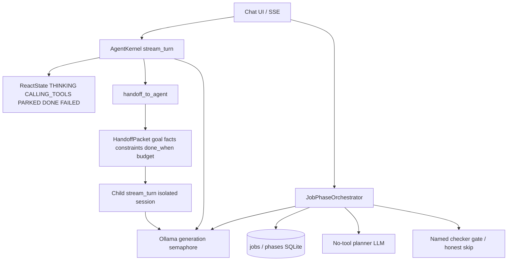
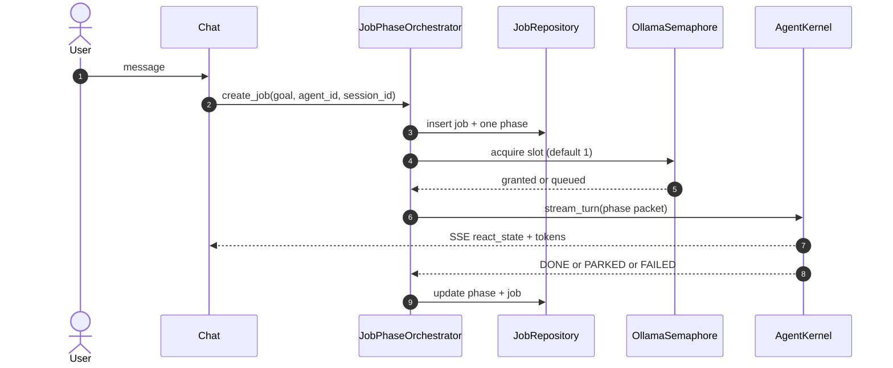
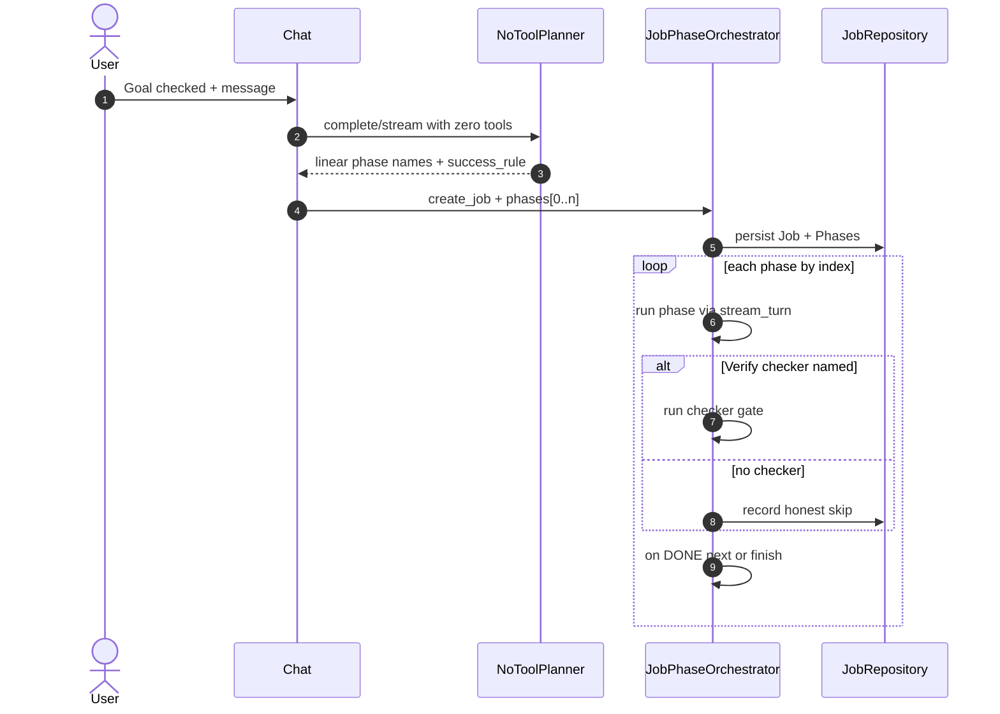
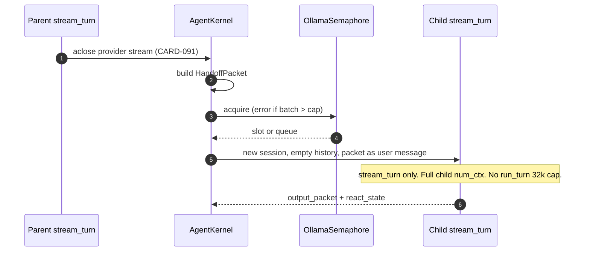

# Technical Design: Control Plane Job Phase

> **Linked Spec**: [`requirements.md`](./requirements.md)
> **Applicable ADRs**: `docs/adr/0001-baseline-sdlc.md`
> **Locked architecture**: control-plane ARCHITECTURE.md (2026-08-29). Do not invent a fourth loop.

---

## 1. Architectural Overview & C4 Context

Adopt proven patterns only: ReAct (Yao), Job/Phase orchestration, OpenAI-style handoff packet filter, Hermes `delegate_task` (fresh child, goal+context only, concurrency cap).



Existing modules this slice extends (no new kernel):

| Layer | Today | Slice A |
|-------|--------|---------|
| Domain orchestration | `HandoffEnvelope`, `HandoffResult` | Add `Job`, `Phase`, `HandoffPacket`, `ReactState` |
| Domain planning | In-memory `ExecutionPlan` / `PlanStep` | Stop being the Goal-mode store |
| App kernel | `agent_kernel.py`, `plan_engine.py` | Named states; planner is no-tool; persist Job+Phases |
| App orchestration | `handoff_engine.py` | Packet filter; child `stream_turn`; no nested `complete()` |
| Settings | provider / context overrides | `max_concurrent_generations` default 1 (range 1–3) |
| Web | Chat SSE + Goal badge | Job/phase/agent/`react_state`; badge must not say Graph |

---

## 2. Sequence Flow

### 2.1 Default chat (Goal unchecked)



### 2.2 Goal checkbox (linear phases, not a DAG)



### 2.3 Child handoff (packet + stream_turn)



---

## 3. Data Contracts & Interfaces

### 3.1 SQLite (minimum)

**jobs**

| Column | Notes |
|--------|--------|
| id | PK |
| goal | User goal text |
| status | queued \| running \| waiting_approval \| done \| failed \| cancelled |
| budget_max_phases | int |
| budget_max_handoffs | int |
| budget_max_ollama_slots | int, must respect global cap |
| current_phase_id | FK-ish to phases.id |
| template_id | nullable; templates are Slice B |
| created_at, updated_at | ISO timestamps |
| session_id, agent_id | Chat session + selected agent |

**phases**

| Column | Notes |
|--------|--------|
| id | PK |
| job_id | FK jobs.id |
| name, index | Linear order. index is the only edge. |
| assigned_agent_id | One agent per phase |
| status | queued \| running \| waiting_approval \| done \| failed \| cancelled |
| success_rule | Phase done_when |
| verify_checker | Named checker or empty |
| input_packet_json, output_packet_json | HandoffPacket |
| parent_phase_id | Nullable; depth cap 2 |
| max_turns | Child budget |
| react_state | THINKING \| CALLING_TOOLS \| PARKED \| DONE \| FAILED |

**proposals** (CARD-101 needs followup_job now; other kinds later)

| Column | Notes |
|--------|--------|
| id | PK |
| kind | skill \| tool \| workflow \| followup_job \| agent |
| payload_json | Draft job fields |
| status | draft \| approved \| rejected |
| requested_by_job_id | Parent job |

**settings / ollama_slots**

- `max_concurrent_generations` integer, default 1, allowed 1–3.
- Runtime semaphore is process-global. If a slot is unavailable, phase status = queued.

### 3.2 Domain ports

```python
class ReactState(str, Enum):
    THINKING = "THINKING"
    CALLING_TOOLS = "CALLING_TOOLS"
    PARKED = "PARKED"
    DONE = "DONE"
    FAILED = "FAILED"


class HandoffPacket(BaseModel):
    goal: str
    facts: list[str]
    constraints: list[str]
    done_when: str
    budget: dict  # max_turns, max_handoffs, max_ollama_slots


class JobRepository(Protocol):
    def create_job(self, job: Job, phases: list[Phase]) -> Job: ...
    def get_job(self, job_id: str) -> Job: ...
    def list_phases(self, job_id: str) -> list[Phase]: ...
    def update_job_status(self, job_id: str, status: str, current_phase_id: str | None) -> None: ...
    def update_phase(self, phase: Phase) -> None: ...


class JobPhaseOrchestrator(Protocol):
    def create_and_run(self, goal: str, agent_id: str, session_id: str, phases: list[Phase] | None) -> Job: ...
    # create job → run phase → on DONE next or finish
```

Existing `HandoffEnvelope` stays as the transport wrapper. The **packet** is the child's user message. `context_payload` must not become a dumped parent transcript.

### 3.3 SSE payload (Chat)

```json
{
  "event": "react_state",
  "job_id": "job_...",
  "phase_id": "phase_...",
  "assigned_agent_id": "assistant",
  "react_state": "CALLING_TOOLS",
  "job_status": "running",
  "phase_name": "Draft reply"
}
```

UI strip: job status, current phase name, assigned agent, `react_state`. Goal control label must not include "Graph" or "Plan Graph".

### 3.4 Local-Ollama handoff contract (non-negotiable)

- Parent `stream_turn` MUST aclose the provider stream before tools (CARD-091).
- Child MUST use the same stream path as parent (CARD-094 intent: stop nested complete). Never `complete()` nested. This spec goes further: child calls `stream_turn`, so the 32k `run_turn` cap does **not** apply.
- Child session: new id, empty history, packet as the user message, child's own max context (131k).
- If Ollama slot unavailable, phase status = queued, not a fake timeout.
- Provider failure maps to phase FAILED, not "Delegation Completed".
- `handoff_to_agent` may accept a batch. If `len(batch) > max_concurrent_generations`, error. Do not silent-truncate.

---

## 4. Error Handling & Edge Cases

| Error Scenario | Detection Point | Handling / Fallback | User Response |
| :--- | :--- | :--- | :--- |
| Missing packet field | Handoff / orchestrator | Fail closed | Tool error; phase stays FAILED |
| Batch > semaphore cap | `handoff_to_agent` | Error, no truncate | Honest error, no silent drop |
| Slot busy | Semaphore | Queue; phase `queued` | UI shows queued, not timeout |
| Provider timeout / connect | Gateway | Phase FAILED | Named FAILED, not Delegation Completed |
| HITL park | Kernel | PARKED + job `waiting_approval` | Chat shows PARKED; resume existing HITL |
| Verify checker missing | Orchestrator | Honest skip (CARD-064) | Record skip; do not claim passed |
| Checker fails | Orchestrator | Phase FAILED or retry per budget | Named FAILED |
| Planner returns a graph | Planner adapter | Reject / flatten to linear index | Persist linear phases only |
| Parent stream still open | Kernel | aclose first (CARD-091) | Child never nested under live HTTP |

---

## 5. UI wireframe (CARD-100)

```text
+------------------------------------------------------------------+
| Chat                    [ Goal ]  [ Verify ]   agent: Assistant  |
|                         ^ not "Plan Graph"                       |
+------------------------------------------------------------------+
| Job running · Phase 1/1 Draft reply · Assistant · THINKING       |
+------------------------------------------------------------------+
|  user: ...                                                       |
|  assistant: ...                                                  |
+------------------------------------------------------------------+
```

PARKED and FAILED replace THINKING in the status strip. Do not rely on transcript-only status.

---

## 6. Mapping to existing code (implementation later; this card is spec-only)

- Add models in `src/domain/orchestration/models.py` and `src/domain/kernel/models.py`.
- Repository beside current SQLite state store / domain repositories (`src/application/orchestration/`, infrastructure SQLite).
- Orchestrator next to `src/application/orchestration/handoff_engine.py` and `src/application/kernel/supervisor_orchestrator.py` — one loop, not a new engine.
- Planner: `src/application/kernel/plan_engine.py` becomes a no-tool call that writes Job+Phases.
- Semaphore: settings-owned; acquired inside gateway/kernel generation, not per-agent wishful parallelism.
- Chat: `src/web` SSE + static Chat strip.

---

## 7. Non-goals (do not design)

LangGraph, `set_goal` tool, training weights, Agent Builder UI, SkillOpt, ACE deltas, Skills Studio, user-data-dir move, job-template YAML (Slice B).
