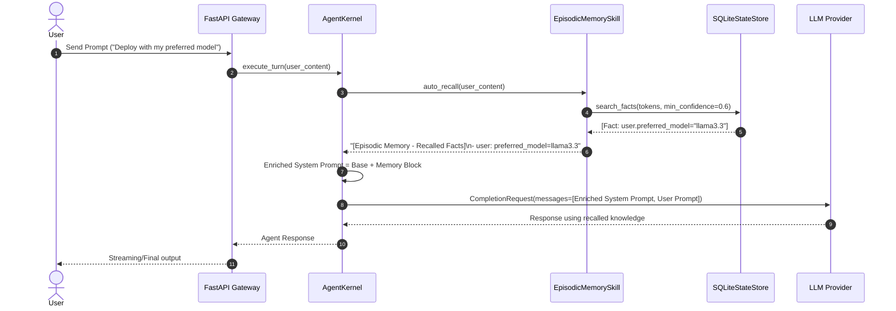

# Technical Design: SQLite Episodic Fact Memory Store & Agent Auto-Recall

> **Spec Status**: In Review  
> **Card Reference**: [CARD-042](file:///.github/cards/CARD-042-sqlite-episodic-fact-memory-store-and-agent-auto-recall.md)  
> **Requirements Reference**: [requirements.md](file:///d:/Projects/Active/AutoReiv/docs/specs/episodic-memory-and-auto-recall/requirements.md)

---

## 1. Architectural Modeling



---

## 2. Component Interfaces & REST Contract

### SQLite Store Extensions (`src/infrastructure/memory/sqlite_store.py`)
```python
def search_facts(
    self,
    query: str,
    entity: Optional[str] = None,
    min_confidence: float = 0.5,
    limit: int = 10,
) -> List[Dict[str, Any]]: ...
```

### Episodic Memory Skill (`src/application/skills/memory_skill.py`)
```python
def render_memory_context(facts: List[Dict[str, Any]]) -> str: ...
def auto_recall(self, prompt: str, entity: Optional[str] = None, limit: int = 5) -> str: ...
```

### REST API Endpoints (`src/web/app.py`)
- `GET /api/memory/facts?q=query&entity=user`
- `POST /api/memory/facts` Body: `{ entity: str, key: str, value: str, confidence?: float, source_session_id?: str }`
- `DELETE /api/memory/facts/{entity}/{key}`
