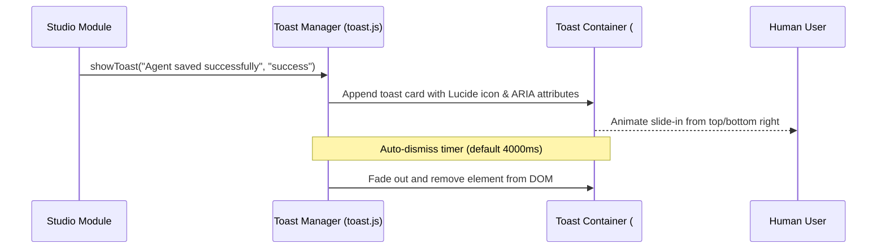

# Technical Design: Error Boundary Toasts & Offline Backend Messaging

> **Spec Status**: In Review  
> **Card Reference**: [CARD-040](file:///.github/cards/CARD-040-error-boundary-toasts-and-offline-backend-messaging.md)  
> **Requirements Reference**: [requirements.md](file:///d:/Projects/Active/AutoReiv/docs/specs/error-boundary-toasts-and-offline-messaging/requirements.md)

---

## 1. Architectural Modeling



---

## 2. Component Design & Signatures

### `src/web/static/modules/ui/toast.js`

```javascript
/**
 * Displays a non-blocking, accessible toast notification.
 * @param {string} message - Notification text.
 * @param {'info'|'success'|'warning'|'error'} [type='info'] - Variant style.
 * @param {number} [duration=4000] - Auto-dismiss timeout in ms (0 for persistent).
 * @returns {HTMLElement} Toast DOM element.
 */
export function showToast(message, type = 'info', duration = 4000) { ... }

/**
 * Initializes the connectivity polling monitor.
 * @param {Object} options
 * @param {string} [options.healthUrl='/api/health']
 * @param {number} [options.intervalMs=15000]
 * @param {Function} [options.onStatusChange]
 */
export function initConnectivityMonitor(options = {}) { ... }
```

---

## 3. UI Wireframe: Toast Notification & Offline Banner

```text
+-------------------------------------------------------------------------+
| ⚠️ Backend Connection Lost. Attempting to reconnect... [Retry Now]      |
+-------------------------------------------------------------------------+
| [AutoReiv SPA Views...]                                                 |
|                                                                         |
|                                     +---------------------------------+ |
|                                     | ✅ Agent Forge: Updated!    [x] | |
|                                     +---------------------------------+ |
+-------------------------------------------------------------------------+
```
