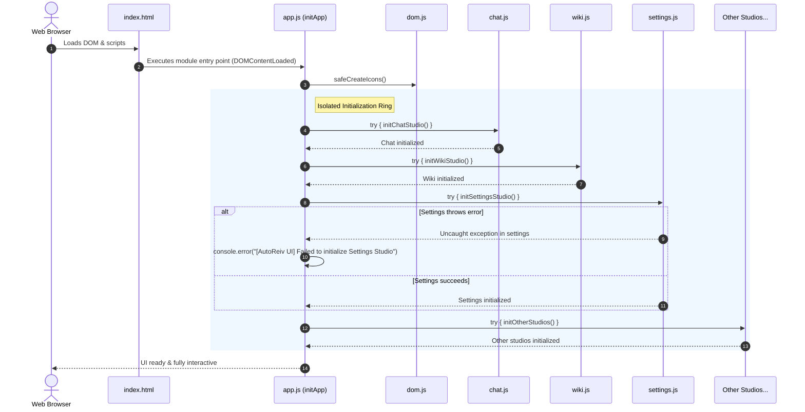

# Technical Design Specification: Frontend Modularization Foundation & Baseline Quality Gates

> **Spec Status**: In Review  
> **Target Release**: Milestone 9 (v0.9.0)  
> **Card Reference**: [CARD-031](file:///.github/cards/CARD-031-frontend-modularization-foundation-and-quality-gates.md)  
> **Requirement Reference**: [requirements.md](file:///d:/Projects/Active/AutoReiv/docs/specs/frontend-modularization/requirements.md)

---

## 1. Architectural Overview & C4 Context

The AutoReiv Web SPA operates as a native vanilla JavaScript Single Page Application communicating with the FastAPI control plane over REST APIs and Server-Sent Events (SSE).

### Component Layout (`src/web/static/`)

```text
src/web/static/
├── app.js                          # Main entry point: module imports & orchestrator
├── modules/
│   ├── dom.js                      # Defensive DOM query helpers ($, $query, safeCreateIcons)
│   ├── services/
│   │   ├── api.js                  # Central HTTP fetch client & JSON helper
│   │   └── sse.js                  # Server-Sent Events streaming consumer
│   ├── state/
│   │   └── store.js                # Shared in-memory UI state (active tab, selected agent/vault)
│   ├── utils/
│   │   ├── debounce.js             # Trailing-edge debounce helper
│   │   ├── formatters.js           # Date, token count, and byte size formatters
│   │   └── storage.js              # Safe localStorage wrapper
│   └── studios/
│       ├── chat.js                 # Chat Studio: message rendering, agent picker, streaming
│       ├── wiki.js                 # Wiki Studio: folder tree, markdown editor, mind-map
│       ├── forge.js                # Agent Forge: prompt builder, tool binding
│       ├── settings.js             # Settings Studio: LLM providers, model matrix, RAM calc
│       ├── observability.js        # Observability: live event stream, KPI metrics
│       ├── docs.js                 # Docs Studio: architecture hierarchy & Mermaid pan/zoom
│       └── routines.js             # Routines Studio: cron scheduler & agent task triggers
```

---

## 2. Sequence Diagram: Resilient Startup Flow



---

## 3. Module Contracts & Public Interfaces

### 3.1 Defensive DOM Module (`modules/dom.js`)
```javascript
export function $(id) {
  const el = document.getElementById(id);
  if (!el) {
    console.warn(`[AutoReiv UI] Element #${id} not found in DOM.`);
    return null;
  }
  return el;
}

export function $query(selector, parent = document) {
  return parent.querySelector(selector);
}

export function $queryAll(selector, parent = document) {
  return Array.from(parent.querySelectorAll(selector));
}

export function safeCreateIcons() {
  if (window.lucide && typeof window.lucide.createIcons === 'function') {
    try {
      window.lucide.createIcons();
    } catch (e) {
      console.warn('[AutoReiv UI] Lucide createIcons error:', e);
    }
  }
}
```

### 3.2 Studio Lifecycle Contract
Every studio under `src/web/static/modules/studios/*.js` exports a standard lifecycle method:
```javascript
export function initXxxStudio(): void
```
- It attaches its own event listeners.
- It pulls initial state via `services/api.js` or `state/store.js`.
- It delegates rendering to dedicated rendering functions within the studio module.

---

## 4. Testing & Verification Architecture

```text
tests/
├── e2e/
│   └── smoke.spec.js               # Playwright zero-console-error & tab presence test
└── unit/
    └── frontend/
        ├── debounce.test.js        # Vitest test for debounce trailing-edge behavior
        ├── formatters.test.js      # Vitest test for token/byte/date formatters
        └── storage.test.js         # Vitest test for safe storage fallback
```

### 4.1 Playwright Smoke Test Contract
```javascript
import { test, expect } from '@playwright/test';

test('AutoReiv Web SPA loads with zero console errors and rendered tabs', async ({ page }) => {
  const errors = [];
  page.on('pageerror', err => errors.push(err.message));
  page.on('console', msg => {
    if (msg.type() === 'error') errors.push(msg.text());
  });

  await page.goto('/');
  
  // Assert core navigation tabs exist
  await expect(page.locator('#tab-chat')).toBeAttached();
  await expect(page.locator('#tab-wiki')).toBeAttached();
  await expect(page.locator('#tab-forge')).toBeAttached();
  await expect(page.locator('#tab-settings')).toBeAttached();
  await expect(page.locator('#tab-observability')).toBeAttached();
  await expect(page.locator('#tab-docs')).toBeAttached();
  await expect(page.locator('#tab-routines')).toBeAttached();

  // Assert zero page or console errors
  expect(errors).toEqual([]);
});
```

---

## 5. Security, Resilience & Honor Constraints

- **Resilience Boundary**: Studio initialization errors are isolated. A fatal bug in one tab cannot bring down the primary navigation or other studios.
- **Zero-Build Integrity**: No node build step required for browser delivery. Vanilla ES module syntax supported natively across all modern evergreen browsers (Chrome, Firefox, Safari, Edge).
- **Node Dev Dependencies**: `package.json` with `vitest` and `@playwright/test` for automated headless CI/pre-flight verification.
