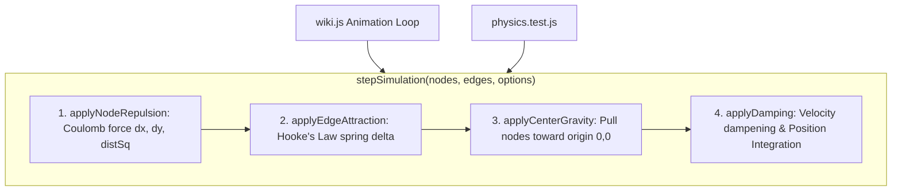

# Technical Design: Comprehensive Unit Test Suite for Frontend Pure Logic

> **Spec Status**: In Review  
> **Card Reference**: [CARD-035](file:///.github/cards/CARD-035-comprehensive-unit-test-suite-for-frontend-pure-logic.md)  
> **Requirements Reference**: [requirements.md](file:///d:/Projects/Active/AutoReiv/docs/specs/frontend-pure-logic-unit-tests/requirements.md)

---

## 1. Architectural Modeling

### Physics Engine Architecture (`src/web/static/modules/utils/physics.js`)


---

## 2. API Contracts

### `src/web/static/modules/utils/physics.js`
```javascript
export const DEFAULT_PHYSICS_CONFIG = {
  repulsion: 120,
  spring: 0.04,
  linkDist: 60,
  damping: 0.88,
  centerGravity: 0.005,
  maxRepulsionDist: 450,
};

export function applyNodeRepulsion(nodes, repulsion = 120, maxDist = 450) { ... }
export function applyEdgeAttraction(edges, linkDist = 60, spring = 0.04) { ... }
export function applyCenterGravityAndDamping(nodes, centerGravity = 0.005, damping = 0.88) { ... }
export function stepSimulation(nodes, edges, config = {}) { ... }
```

### `src/web/static/modules/state/store.js`
```javascript
export function createStore(initialState = {}) {
  let currentState = { ...initialState };
  const listeners = new Set();

  return {
    getState() {
      return currentState;
    },
    setState(updater) {
      const nextState = typeof updater === 'function' ? updater(currentState) : { ...currentState, ...updater };
      currentState = nextState;
      listeners.forEach(fn => fn(currentState));
    },
    subscribe(listener) {
      listeners.add(listener);
      return () => listeners.delete(listener);
    },
  };
}
```
