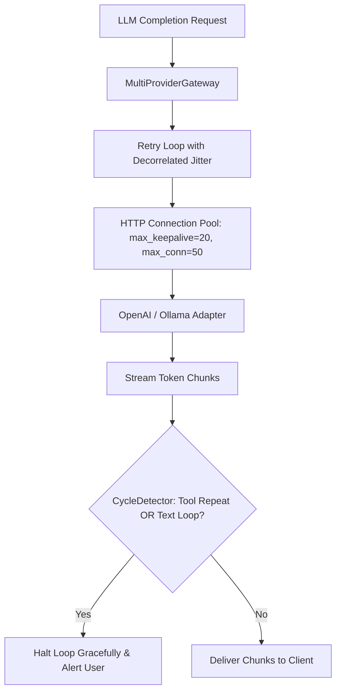

# Technical Design: Gateway Resilience Hardening & Streaming Cycle Detection

> **Spec Status**: In Review  
> **Card Reference**: [CARD-043](file:///.github/cards/CARD-043-gateway-resilience-hardening-and-streaming-cycle-detection.md)  
> **Requirements Reference**: [requirements.md](file:///d:/Projects/Active/AutoReiv/docs/specs/gateway-resilience-and-cycle-detection/requirements.md)

---

## 1. Architectural Modeling



---

## 2. Signatures & Interface Updates

### `MultiProviderGateway` (`src/application/gateway/gateway_service.py`)
```python
@staticmethod
def calculate_backoff(
    attempt: int,
    initial_delay: float = 0.2,
    backoff_factor: float = 2.0,
    max_delay: float = 4.0,
) -> float: ...
```

### `CycleDetector` (`src/application/kernel/cycle_detector.py`)
```python
class CycleDetector:
    def compute_signature(self, tool_calls: List[ToolCall]) -> str: ...
    def record_and_check(self, tool_calls: Optional[List[ToolCall]]) -> bool: ...
    def record_and_check_text(self, text: str, min_phrase_len: int = 20, repeats_threshold: int = 3) -> bool: ...
    def reset(self) -> None: ...
```
