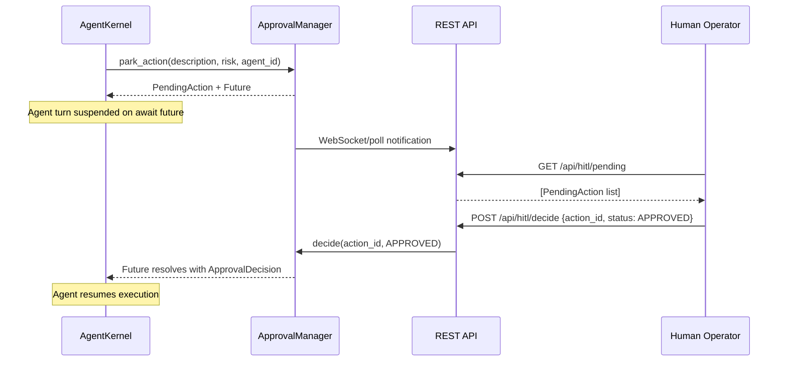

# Technical Design: Human-In-The-Loop (HITL) Interactive State Parking, Action Approval & Resume Engine

> **Spec Status**: In Review  
> **Card Reference**: [CARD-046](file:///.github/cards/CARD-046-human-in-the-loop-interactive-state-parking-action-approval-and-resume-engine.md)  
> **Requirements Reference**: [requirements.md](file:///d:/Projects/Active/AutoReiv/docs/specs/hitl-approval-engine/requirements.md)

---

## 1. Architectural Modeling



---

## 2. Signatures & Interface Updates

### `src/domain/hitl/models.py`
```python
class ApprovalStatus(str, Enum):
    PENDING = "pending"
    APPROVED = "approved"
    REJECTED = "rejected"
    EXPIRED = "expired"

class PendingAction(BaseModel):
    action_id: str           # UUID
    description: str
    risk_level: RiskLevel
    agent_id: str
    session_id: str
    tool_name: Optional[str]
    tool_args: Optional[Dict[str, Any]]
    status: ApprovalStatus
    created_at: float        # time.time()

class ApprovalDecision(BaseModel):
    action_id: str
    status: ApprovalStatus
    decided_at: float
    reason: Optional[str]
```

### `src/application/hitl/approval_manager.py`
```python
class ApprovalManager:
    def park_action(self, description, risk_level, agent_id, session_id, ...) -> Tuple[PendingAction, asyncio.Future]: ...
    def decide(self, action_id, status, reason=None) -> ApprovalDecision: ...
    def list_pending(self) -> List[PendingAction]: ...
    def get_action(self, action_id) -> Optional[PendingAction]: ...
```

### `src/web/app.py` — New REST Endpoints
```
GET  /api/hitl/pending          → List[PendingAction]
POST /api/hitl/decide           → ApprovalDecision
```
