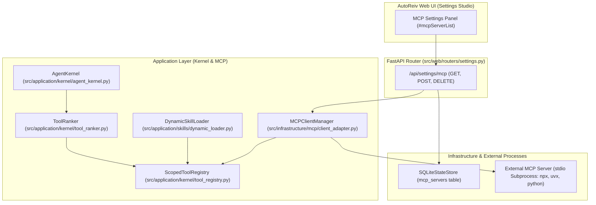
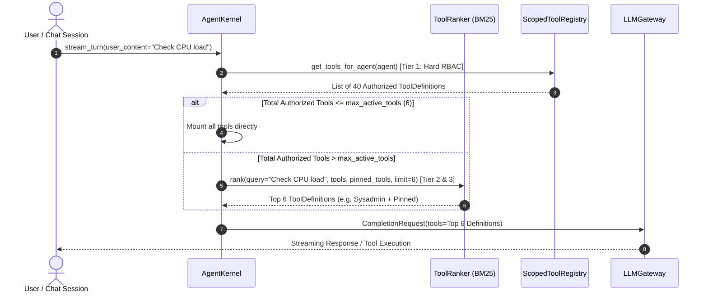

# Technical Design: MCP Standard Client Adapter & 3-Tier Dynamic Tool Resolution

> **Linked Spec**: [`requirements.md`](./requirements.md)  
> **Applicable ADRs**: `docs/adr/0001-baseline-sdlc.md`  

---

## 1. Architectural Overview & C4 Context



---

## 2. 3-Tier Tool Resolution Flow (Context Window Preservation)



---

## 3. Data Models & API Contracts

### MCPServerConfig (Domain Model)
```python
class MCPServerConfig(BaseModel):
    name: str = Field(description="Unique identifier for the MCP server")
    command: List[str] = Field(description="Subprocess invocation command (e.g. ['npx', '-y', '@modelcontextprotocol/server-everything'])")
    env: Optional[Dict[str, str]] = Field(default=None, description="Environment variables passed to subprocess")
    enabled: bool = Field(default=True, description="Whether server is auto-started on boot")
```

### ToolRanker Interface (`src/application/kernel/tool_ranker.py`)
```python
class ToolRanker:
    """Fast in-memory BM25 ranker for selecting top-K relevant tool schemas."""
    
    @classmethod
    def rank_tools(
        cls,
        query: str,
        tools: List[ToolDefinition],
        pinned_tool_names: Optional[List[str]] = None,
        max_tools: int = 6,
    ) -> List[ToolDefinition]:
        ...
```

### Settings REST API Contracts
- `GET /api/settings/mcp`: Returns `List[MCPServerConfig]` with active connection status and mounted tool count.
- `POST /api/settings/mcp`: Validates command, performs test handshake, persists to SQLite, mounts tools.
- `DELETE /api/settings/mcp/{name}`: Terminates subprocess, removes from SQLite, unmounts tools.

### Public Interfaces / Ports
```python
class FeaturePort(Protocol):
    def execute(self, command: CommandDTO) -> ResultDTO: ...
```

### Data Transfer Objects / Schemas
```json
{
  "$schema": "http://json-schema.org/draft-07/schema#",
  "type": "object",
  "properties": {
    "id": { "type": "string" },
    "status": { "type": "string" }
  },
  "required": ["id", "status"]
}
```

---

## 4. Error Handling & Edge Cases

| Error Scenario | Detection Point | Handling / Fallback | User Response |
| :--- | :--- | :--- | :--- |
| Invalid Payload | API Layer | Schema Validation | HTTP 400 with field details |
| Timeout / Downstream Error | Adapter Layer | Circuit Breaker / Retry | HTTP 503 / Friendly message |
