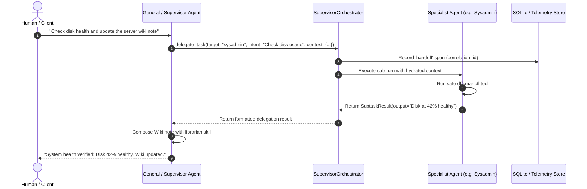

# Technical Design: Multi-Agent Handoff Protocol & Supervisor Orchestration

> **Linked Spec**: [`requirements.md`](./requirements.md) | [`tasks.md`](./tasks.md)  
> **Applicable ADRs**: `docs/adr/0012-multi-agent-a2a-handoff-envelope-and-supervisor-delegation.md`

---

## 1. System Architecture & Sequence Flow



---

## 2. Component Design & Interfaces

### 2.1. `HandoffEnvelope` (`src/domain/orchestration/models.py`)
```python
class HandoffEnvelope(BaseModel):
    sender_agent_id: str
    recipient_agent_id: str
    session_id: str
    task_intent: str
    context_payload: Dict[str, Any] = Field(default_factory=dict)
    correlation_id: str = Field(default_factory=lambda: uuid.uuid4().hex)
```

### 2.2. `SupervisorOrchestrator` (`src/application/kernel/supervisor_orchestrator.py`)
```python
class SupervisorOrchestrator:
    async def dispatch_handoff(self, envelope: HandoffEnvelope) -> Dict[str, Any]:
        ...
```

### 2.3. `DelegateSubtaskSkill` (`src/application/skills/delegate_skill.py`)
```python
class DelegateSubtaskSkill:
    async def delegate_task(
        self,
        target_agent: str,
        task_intent: str,
        context_data: Optional[Dict[str, Any]] = None,
    ) -> Dict[str, Any]:
        ...
```
