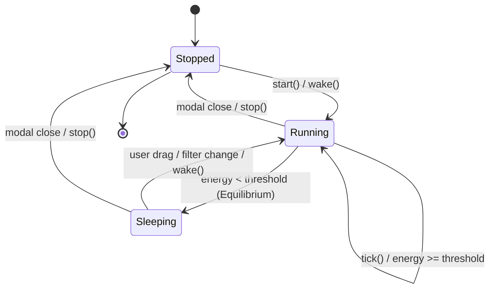

# Technical Design: Performance Budgets, Module Bundling & First-Paint Optimization

> **Spec Status**: In Review  
> **Card Reference**: [CARD-039](file:///.github/cards/CARD-039-performance-budgets-and-first-paint-optimization.md)  
> **Requirements Reference**: [requirements.md](file:///d:/Projects/Active/AutoReiv/docs/specs/performance-and-first-paint-opt/requirements.md)

---

## 1. Architectural Modeling



---

## 2. Module Interfaces & Signatures

### `src/web/static/modules/utils/physics.js`

```javascript
/**
 * Calculates total system kinetic energy (sum of v_x^2 + v_y^2).
 * @param {Array<{vx?: number, vy?: number}>} nodes
 * @returns {number}
 */
export function calculateKineticEnergy(nodes) { ... }

/**
 * Creates an animation simulation runner with automatic energy sleeping.
 * @param {Object} options
 * @param {Function} options.onTick
 * @param {Function} options.onRender
 * @param {Function} options.getNodes
 * @param {number} [options.energyThreshold=0.005]
 * @returns {{ start: Function, stop: Function, wake: Function, isRunning: Function, isSleeping: Function }}
 */
export function createSimulationRunner(options) { ... }
```

---

## 3. First-Paint & Asset Preloading
In `src/web/templates/index.html`:
```html
<link rel="modulepreload" href="/static/app.js">
<link rel="modulepreload" href="/static/modules/dom.js">
<link rel="modulepreload" href="/static/modules/state/store.js">
```
