# Technical Design: Playwright CI Pre-Flight Gate & Multi-Studio Navigation Smoke Suite

> **Spec Status**: In Review  
> **Card Reference**: [CARD-032](file:///.github/cards/CARD-032-playwright-ci-pre-flight-gate-integration-and-multi-studio-navigation-smoke-suite.md)  
> **Requirements Reference**: [requirements.md](file:///d:/Projects/Active/AutoReiv/docs/specs/playwright-ci-and-smoke-suite/requirements.md)

---

## 1. Architecture & CI/CD Pipeline Context

### CI Workflow Topology

```mermaid
flowchart LR
    A[Git Push / PR] --> B[GitHub Actions Runner]
    B --> C[Step 1: Setup Python 3.12 & Node 20]
    C --> D[Step 2: Install UV + Dependencies]
    D --> E[Step 3: Lint & Typecheck via Ruff]
    E --> F[Step 4: Pytest Suite - 273 Tests]
    F --> G[Step 5: Vitest Frontend Units]
    G --> H[Step 6: Playwright Chromium Install]
    H --> I[Step 7: Playwright Multi-Studio Smoke Suite]
    I --> J[Step 8: RTM Verification Gate]
    J --> K[✅ CI Green / Ready to Merge]
```

---

## 2. Component Design & Test Decomposition

### A. CI Workflow (`.github/workflows/ci.yml`)
- Runs on `ubuntu-latest`.
- Uses `astral-sh/setup-uv@v5` for ultra-fast dependency caching.
- Uses `actions/setup-node@v4` with Node 20.
- Starts the FastAPI test server on port `8765` via Playwright `webServer` configuration.

### B. Exhaustive Multi-Studio Smoke Suite (`tests/e2e/smoke.spec.js`)
The smoke test suite is decomposed into 4 deterministic test cases:
1. `initial page load`: Verifies zero console errors, zero uncaught page exceptions, title, topbar agent selector presence.
2. `studio navigation & DOM attachment`:
   - Chat: `#messagesContainer`, `#chatPromptInput`, `#chatTopBarAgentSelect`.
   - Routines: `#routinesTable`, `#newRoutineBtn`.
   - Observability: `#systemLogsTerminal`, `#logSearchInput`, `#logLevelSelect`.
   - Agent Forge: `#forgeAgentGrid`, `#forgeSkillCatalog`.
   - Settings: `#provPresetSelect`, `#provModelSelect`, `#modelFitTableBody`.
   - System Manual: `#docsNavTree`, `#docViewerContent`.
   - Wiki Vault: `#wikiNavTree`, `#wikiViewerContent`, `#wikiNewNoteBtn`.
3. `modal & interactive flows`:
   - Search in Docs Studio and assert topic filtering.
   - Open and close Obsidian-style Mind Map 2D canvas (`#wikiMindMapModal`).
   - Open and close New Routine Modal (`#routineModal`).
   - Open and close New Note Modal (`#wikiNewNoteModal`).
4. `agent switching reactivity`:
   - Change `#chatTopBarAgentSelect` and assert `#activeAgentTitle` and `localStorage` synchronization.

### C. Unified Pre-Flight Script (`.agents/skills/rtm-sync/scripts/preflight.py`)
- Executes:
  1. `ruff check .`
  2. `pytest -q`
  3. `npm run test:unit:frontend`
  4. `npm run test:smoke`
  5. `python .agents/skills/rtm-sync/scripts/verify_rtm.py`
- Provides formatted color summary terminal output.

---

## 3. Data Contracts & Error Boundaries

- Playwright intercepts `page.on('console')` filtering for `error` and `page.on('pageerror')`.
- Test suite fails if any console error or page exception is recorded during the run.
- Traces and screenshots retained on failure via `screenshot: 'only-on-failure'` and `trace: 'retain-on-failure'`.
