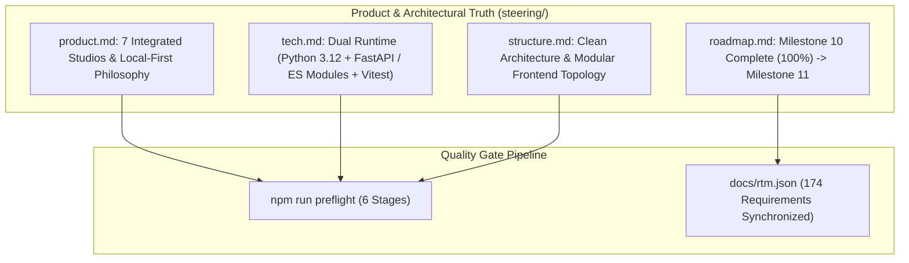

# Technical Design: Steering & Product Documentation Truth Sync

> **Spec Status**: In Review  
> **Card Reference**: [CARD-037](file:///.github/cards/CARD-037-steering-and-product-documentation-truth-sync.md)  
> **Requirements Reference**: [requirements.md](file:///d:/Projects/Active/AutoReiv/docs/specs/product-docs-truth-sync/requirements.md)

---

## 1. Architectural Modeling

---

## 2. Documentation Architecture Plan

1. **`steering/product.md`**:
   - Executive Vision: Local-first AI agent control plane.
   - 7 Studios: Chat, Routines, Observability, Agent Forge, Settings, Docs, Wiki & Mind Map.
   - Core Capabilities: Hybrid routing, deterministic tools, HITL approvals, telemetry tracking.

2. **`steering/tech.md`**:
   - Backend: Python 3.12+, FastAPI, SQLite, Pydantic, Astral UV, Pytest, Ruff.
   - Frontend: Vanilla JS Native ES Modules, Tailwind CSS, Lucide icons, Mermaid.js, Vitest, ESLint 9, Prettier, Playwright.
   - Unified Pre-Flight runner: `npm run preflight`.

3. **`steering/structure.md`**:
   - Expand structural layout detailing `src/web/static/modules/` (`studios/`, `services/`, `utils/`, `state/`), `tests/unit/frontend/`, `tests/integration/`, `tests/e2e/`.

4. **`steering/roadmap.md`**:
   - Mark Milestone 10 (v0.10.0 - P1 Quality & Testability) as 100% complete.
