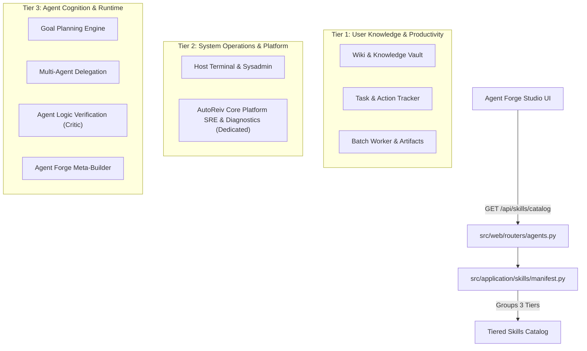

# Technical Design: Skill Pack Taxonomy Realignment & AutoReiv Dedicated Diagnostics

> **Card ID**: [`CARD-056`](file:///d:/Projects/Active/AutoReiv/.github/cards/CARD-056-skill-pack-taxonomy-realignment-and-autoreiv-dedicated-diagnostics.md)  
> **Milestone**: 20  
> **Status**: Approved  
> **Requirements**: `[REQ-TAX-001]` to `[REQ-TAX-005]`

---

## 1. Architectural Overview & C4 Context



---

## 2. Visual Contract: Agent Forge Studio Tiered Layout

```text
+-----------------------------------------------------------------------------------------------+
| 🛠️ AGENT FORGE STUDIO                                                                         |
+-----------------------------------------------------------------------------------------------+
| Agent Profile Editor: [ 🤖 AutoReiv (Production SRE)                                     v ]  |
+-----------------------------------------------------------------------------------------------+
|                                                                                               |
| 📖 USER KNOWLEDGE & PRODUCTIVITY                                                              |
| ───────────────────────────────────────────────────────────────────────────────────────────── |
| [v] 📚 Wiki & Knowledge Vault (8 tools) [ Select All ]                                         |
|     [x] wiki_note_create   [x] wiki_note_read   [x] wiki_note_update   [x] wiki_note_search   |
|     [x] wiki_note_list     [x] wiki_note_organize [x] wiki_overview    [x] wiki_graph         |
| [v] 📋 Task & Action Tracker (4 tools) [ Select All ]                                         |
|     [x] task_tracker_create [x] task_tracker_list [x] task_tracker_update [x] task_tracker_del|
| [v] 📦 Batch Worker & Map-Reduce Pack (3 tools) [ Select All ]                                |
|     [x] batch_worker_scan  [x] get_session_artifact [x] promote_artifact_to_wiki               |
|                                                                                               |
| ⚙️ SYSTEM OPERATIONS & PLATFORM                                                               |
| ───────────────────────────────────────────────────────────────────────────────────────────── |
| [v] 🖥️ Linux Sysadmin Pack (2 tools) [ Select All ]                                           |
|     [x] cli_exec           [x] system_info                                                    |
| [v] ⚙️ AutoReiv Core Platform SRE & Diagnostics (8 tools) [ ⭐ Core AutoReiv ] [ Select All ]|
|     [x] inspect_system_health [x] get_recent_errors [x] get_tool_health_matrix               |
|     [x] get_agent_usage_summary [x] get_system_logs [x] test_provider_connectivity             |
|     [x] get_agent_sessions    [x] get_session_transcript                                      |
|                                                                                               |
| 🧠 AGENT COGNITION & RUNTIME                                                                  |
| ───────────────────────────────────────────────────────────────────────────────────────────── |
| [v] 🎯 Plan & Execute Goal Pack (3 tools) [ Select All ]                                      |
|     [x] get_active_plan    [x] mark_plan_step_completed [x] append_plan_step                  |
| [v] 🌐 Multi-Agent Handoff & Delegation Pack (3 tools) [ Select All ]                          |
|     [x] lookup_agents      [x] handoff_to_agent [x] delegate_task                             |
| [v] 🛡️ Agent Logic Verification (Critic) (3 tools) [ Select All ]                             |
|     [x] assert_json_schema [x] validate_metric_bounds [x] verify_telemetry_consistency        |
| [v] ✨ Agent Forge Meta-Builder Pack (3 tools) [ Select All ]                                 |
|     [x] list_available_skills_and_tools [x] propose_agent_specification [x] save_agent_spec    |
+-----------------------------------------------------------------------------------------------+
```

---

## 3. Data Contract & REST API

### `GET /api/skills/catalog`
```json
{
  "tools": [...],
  "tiers": [
    {
      "id": "productivity",
      "name": "User Knowledge & Productivity",
      "description": "User-facing workspace tools, knowledge vaults, task management, and file audits.",
      "icon": "book-open"
    },
    {
      "id": "system",
      "name": "System Operations & Platform",
      "description": "Host command execution, hardware telemetry, and dedicated AutoReiv platform diagnostics.",
      "icon": "terminal"
    },
    {
      "id": "cognition",
      "name": "Agent Cognition & Runtime",
      "description": "Autonomous planning, multi-agent delegation, self-verification critic, and meta-agent builders.",
      "icon": "brain"
    }
  ],
  "skill_packs": [
    {
      "id": "wiki",
      "name": "Wiki & Knowledge Vault",
      "tier": "productivity",
      "icon": "book-open",
      "is_core": false,
      "tools": [...]
    },
    {
      "id": "diagnostics",
      "name": "AutoReiv Core Platform SRE & Diagnostics",
      "tier": "system",
      "icon": "cpu",
      "is_core": true,
      "core_agent_id": "autoreiv",
      "tools": [...]
    }
  ]
}
```
