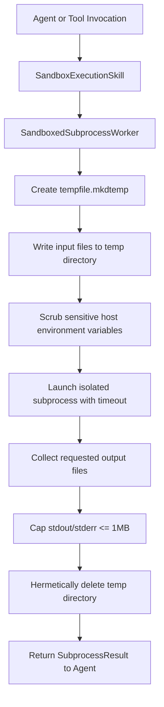

# Technical Design: Ephemeral Subprocess Execution Sandbox & Process Isolation

> **Spec Status**: In Review  
> **Card Reference**: [CARD-044](file:///.github/cards/CARD-044-ephemeral-subprocess-execution-sandbox-and-process-isolation.md)  
> **Requirements Reference**: [requirements.md](file:///d:/Projects/Active/AutoReiv/docs/specs/subprocess-sandbox-isolation/requirements.md)

---

## 1. Architectural Modeling



---

## 2. Signatures & Interface Updates

### `SubprocessResult` & `SandboxedSubprocessWorker` (`src/application/skills/sandbox_worker.py`)
```python
@dataclass
class SubprocessResult:
    stdout: str
    stderr: str
    exit_code: int
    success: bool
    error: Optional[str] = None
    output_files: Optional[Dict[str, str]] = None
    truncated: bool = False


class SandboxedSubprocessWorker:
    @classmethod
    async def run_sandboxed(
        cls,
        args: List[str],
        timeout_seconds: float = 30.0,
        env_overrides: Optional[Dict[str, str]] = None,
        files: Optional[Dict[str, str]] = None,
        read_outputs: Optional[List[str]] = None,
        max_output_bytes: int = 1_000_000,
    ) -> SubprocessResult: ...

    @classmethod
    async def run_python_code(
        cls,
        code: str,
        timeout_seconds: float = 30.0,
        files: Optional[Dict[str, str]] = None,
        read_outputs: Optional[List[str]] = None,
    ) -> SubprocessResult: ...
```

### `SandboxExecutionSkill` (`src/application/skills/sandbox_skill.py`)
```python
class SandboxExecutionSkill:
    def get_tool_definitions(self) -> List[ToolDefinition]: ...
    def register_tools(self, registry: ScopedToolRegistry) -> None: ...
    async def execute_code(
        self,
        language: str,
        code: str,
        timeout_seconds: float = 30.0,
        files: Optional[Dict[str, str]] = None,
    ) -> Dict[str, Any]: ...
```
